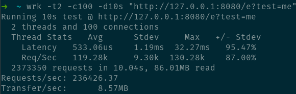

# plutos
[](https://circleci.com/gh/maxim-kuderko/plutos)


| ENV  | Description |
| ------------- | ------------- |
| PORT  | application port i.e: ":8080" |
| DRIVER  | s3 / sqs / stdout / stub |
| ENABLE_COMPRESSION  | true / false  |
| MAX_BUFFER_TIME_MILLISECONDS  | must be >=1  |
| S3_BUCKET  | S3 bucket name  |
| S3_PREFIX  | Mandatory prefix inside the bucket (no / as prefix or suffix)  |
| SQS_ENDPOINTS  | Comma separated full path urls to SQS quues  |
| SQS_BUFFER  | bytes to keep in memory before flushing to sqs max is 256 KB recommended is multiples of 64KB  |
| AWS_ACCESS_KEY_ID  | if running in a docker without AWS access or outside of AWS must provide credentials  |
| AWS_SECRET_ACCESS_KEY  | if running in a docker without AWS access or outside of AWS must provide credentials  |

# How to run

```shell
docker run --netowrk=host \
       -e PORT=:8080 \
       -e DRIVER=s3 \
       -e S3_REGION=<REGION> \
       -e S3_BUCKET=<BUCKET> \
       -e S3_PREFIX=data \
       -e MAX_BUFFER_TIME_MILLISECONDS=60000 \
       -e ENABLE_COMPRESSION=true \
       -e AWS_ACCESS_KEY_ID=<AWS_KEY> \
       -e AWS_SECRET_ACCESS_KEY=<AWS SECRET>  \
       -e SQS_QUEUE=<SQS_ENDPOINT>
       maxkuder/plutos:0.2.0
```

from source:

```shell
go get ./... && go build -o plutos cmd/fasthttp.go
chmox +x plutos
./plutos
```

- running with network=host increases performance by up to x2

# Benchmarks

i7 6700K @ 4.0Ghz <br>
GOMAXPROCS=6 <br>
wrk -t2 -c100 -d10s "http://127.0.0.1:8080/e?test=me" <br>

